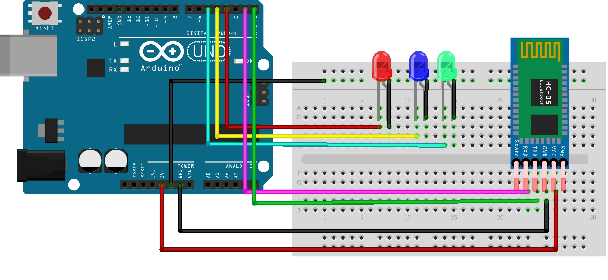

<h1 align="center">:snowflake: ArduinoUno X HC-05 :snowflake:</h1>
<p align="center"> 
Esta proyecto Tiene el Proposito de Comunicar Correctamente un ArduinoUno(Original o Clon) con un Modulo Bluetooth HC-05 o HC-06
<p/>

<p/>

## Componentes Sugeridos
| 👾                                     |
| ------------------------------------- |
| *ArduinoUno*                          |
| *Modulo HC-05*                        |
| *Diodos Led(Rojo, Verde, Amarillo)*   |
| *Resistencias de 230 Ohms*            |
| *Jumpers(Cables)*                     |

<p/>

## Como Usar desde el Software Bluetooth
<br>

- Simplemente tienes que conectar el Arduino a Corriente y Vincularlo desde el Software Usado
- Para Encencer y/o Apagar uno de los Leds unicamente tienes que escribir su Color en La Terminal o Precionar el Boton Configurado Previamente en el Software a Utilizar

Si quiere Encender Todos Escriba:
```bash
Todos
```

Si quiere Apagar Todos Escriba:
```bash
Ninguno
```
<p/>

## A Tomar En Cuenta
- Debido a que uso la Libreria SoftwareSerial, se liberaron los pines 0 (RX) y 1 (TX) para cargar código sin necesidad de Desconectarlos durante la subida del codigo al Arduino(Ya que de lo contrario habrian problemas con el Puerto USB, impidiendo la Subida del Codigo), por lo que deberas de Conectar RX en el pin 2 y TX en el pin 3.
- Es necesaria una Aplicacion para Controlar todo Esto desde tu un Dispositivo con Bluetooth, unicamente lo Probe en Android y la unica Pieza de Software que me dejaba conectar correctamente el Modulo HC-05 era [Serial Bluetooth Terminal][Serial Bluetooth Terminal], pero en caso de Usar otro Software se debera de Configurar la entrada usada para Usar por GUI o Modificar el Codigo.

<p/>

## Imagenes
<p/>

### Diagrama de Referencia


### Ejemplo con un Solo LED



[Serial Bluetooth Terminal]: https://play.google.com/store/apps/details?id=de.kai_morich.serial_bluetooth_terminal&hl=es_MX&pli=1
